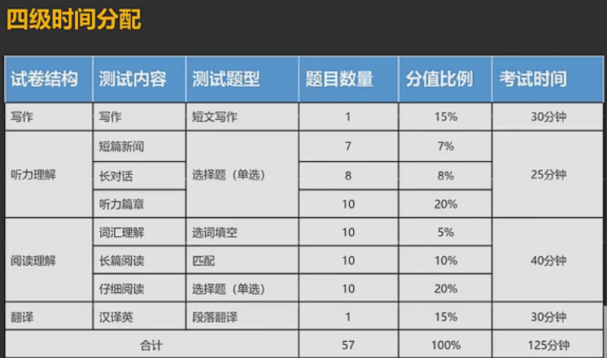

# 英语四级

**写作（22min）+听力预读（7min）→听力（25min）→仔细阅读（两篇20min）→长篇阅读（15min）→翻译（25min）→选词填空（剩余时间）**

------

## 第一部分：写作

### 写作和翻译保底原则

#### 单词和语法正确

- 用该单词的**上位词**（e.g.热情的人→好人 教授→老师 守门员→运动员）
- 用会的单词把不会的词**解释**出来
- 用该单词的**同义词或近义词替换**
- 所有写不出来的长难句暂时先**写成简单句**保证语法正确

------

### 写作翻译高分原则

#### 语言多变

- **单词语法**多变
- **句型**多变

#### 逻辑关系清晰

- 句子和句子之间多用**逻辑关系词**

#### 内容切题

- 不跑题，不要太注重内容

------

### 四级写作常见题型：

#### 论说文

#### 谚语警句

#### 书信

------

### 句子的分类

**结构上**：简单句 并列句 复合句

**语序上**：倒装和正常语序

**语态上**：主动和被动

#### 一.短句的写法

#### 二.被动

- 很多人认为合作比个人能力更重要。

  *Cooperation **is claimed to** be more **crucial** than personal ability.*

- 人们普遍认为网购已经成为一种流行趋势。

  *On-line shopping **is argued to** be a popular **trend** among the young and the old.*

- 在过去几十年里，政府采取了各种措施防止灾害发生。

  ***Various** measures,**in the past decades**,**have been taken to** prevent disasters.*

- 最近，中国科学院（Chinese Academy of Sciences)出版了关于其最新科学发现与<u>未来一年展望</u>的年度系列报告。___并列语句中不会写的单词选择忽略不写___

  *An ~~annual~~ report about its latest scientific findings and ~~the prospect of the next year~~ was recently published by Chinese Academy of Science.*

> **总结：**汉语中只要提到”我们、人们、大家、越来越多的人、许多人等人称代词作为主语的时候就可以考虑被动

#### 三.并列句

##### 常见的逻辑关系词

###### 1.表因果

- 表原因：because,in that,because of = **be responsible for** = due to
- 表结果：thus,consequently = **in consequence**,therefore,as a result

###### 2.对比关系

- 表“相似性”：likewise = similarly = equally = **simultaneously** [ˌsɪməlˈteɪniəsli]= at the same time = in the meanwhile
- 表“差异性”：by contrast = conversely = **alternatively** = on other hand = otherwise = while
- 表“递进”：besides = in addition = **furthermore** = put another way = in other words
- 表“让步”：although = despite = in spite of , **there is no doubt/denying that...**毫无疑问的是...(一般用于开头)
- 表“条件”：if
- 表“目的”：to = **in order to** = so as to
- 表引出新对象：with regard to关于，when it comes to... 当提到...时,in terms of 就...而论
- 表“强调”：**in effect/reality** = **virtually** 事实上，实际上
- 表“结论”：all in all = in conclusion = **substantially** = to sum up 总的来说 in a word简而言之  in any case = **at any rate** = anyway 无论如何
- 表“举例”：such as = for instance/example 

:star2:   e.g.

- 在过去一千年里,乌镇的水系和生活方式并未经历多少方式，是一座展现古文明的博物馆。

  *In the past thousand years,the water system and the lifeway in Wuzhen have not gone through many changes. **Therefore**,it now is the museum to show ancient civilization.*

- 在山东潍坊市，风筝不仅仅是玩具，而且还是这座城市文化的标志 。

  *In Weifang, Shandong**(先写小地点后写大地点)** ,kite**s（可数名词不能单独使用） **are **not only** toys **but also** the symbol**s** of culture**s** of the city.*

- 这些资金用于改善教学设施、购买书籍，使16万多所中小学收益。资金还用于购置音乐和绘画器材。现在农村和山区的儿童可以与沿海城市的儿童一样上音乐和绘画课。

  *These funds are used to improve educational facilities,purchase books and more than 160 thousand primary schools and middle schools will benefit from it .**In addition**,the fund is to be used for purchasing music and painting facilities.**As a consequence**,nowadays the children in rural areas can have music and painting classes **as sames as** the children in the coastal cities do.*

- 由于这个传统，许多年轻人婚后继续与父母同住，今天，这个传统正在改变。随着住房条件的改善，越来越多年轻夫妇选择与父母分开住。但他们之间的联系依然很密切。许多老年人仍然帮着照看孙辈。年轻夫妇也抽时间探望父母，特别是在春节和中秋节等重要节日。

  ***As a result of** this traditon,many young people continue to live with their parents after marriage.**By contrast ,**today, the tradition is changing.<u>With the improvement of housing conditions</u>, <u>an increasing number of</u> young couples choose to live <u>apart from</u> their parents.**Nervertheless,** the connection between them remains strong . Many old people still have to look after their grandchildren.**At the same time**,young coouples also **get around to** visit their parents,**especially** during the holidays,**such as** the Spring Festival and Mid-autumn Festival.*

#### 四.复合句

##### 1.主语从句

> 把主语从句放到句末，加it做形式主语，可以写在任何句子的前面用来拉长句子

- **大学教育极大地促进了社会的进步(主语）**是显而易见的。

  ***It is beyond dispute that** university education **promotes** the progress of our society obviously.*

- *It is ... that*
- *It is common/universally  knowledge that ...*
- *It is my belief that... = I think that...*
- *It is been found that ...*

##### 2.同位语

> 只能跟在名词后面，解释名词

- *Garbage sorting, **a necessary behavior to control pollution**, prove quite crucial throughout China.*

- *Hunting for jobs,**a hot topic among undergraduates**, has become the publicconcern recently.*

- *Optimism,**an active mentality** ,plays a key role **in the general routine of everyday living**=in the daliy life.*

##### 3.定语和定语从句

- *I love this **kind** girl.*

  > 形容词修饰名词

- *I love the girl **of kindness**.*

  > 名词修饰名词

- *I love the girl **as kind as** an angel.*

  > 介词短语修饰名词

- *I love the girl **being as kind as** an angel.*

  > 非谓语动词修饰名词

- *I love the girl **who keeps so kind**.*

  > 从句修饰名词

- :star2:e.g.

  - 中国结最初是由手工艺人发明的，经过数百年不断的改进，已经成为一种优雅多彩的艺术和工艺。
    *The Chinese knot was originally invented by the **craftsmen,**<u>which has become a kind of elegant and colorful arts and crafts after hundreds of years of continuous improvement.</u>*

  - 乌镇是浙江的一座古老水镇，坐落在京杭大运河畔。这是一处迷人的地方，有许多古桥、中式旅店和餐馆。

    *Wuzhen,**which is an ancient water town of Zhejiang province,**is located near the Beijing-Hangzhou Grand Canal,**which is really a charming place** **with many ancient bridges**,Chinese style hotels and restaurants there.*

  - 功夫是中国武术的俗称。中国武术的起源可以追溯到自卫的需要、狩猎活动以及古代中国的军事训练。它是中国传统体育运动的一种，年轻人老年人都练。

    *Kung Fu is the common name of Chinese martial arts **which can be traced back to self-defense needs**, hunting acitivities and military training in ancient China.Besides,it is a traditional Chinese sport that both the young and the elderly can practise.*

  - 剪纸(paper cutting)是中国最为流行的传统民间艺术形式之一。中国剪纸有一千五百多年的历史，在明朝和清朝时期(the Ming and Qing Dynasties)特别流行。
    *Paper cutting is one of the most popular arts in china **which has a history** **of 1.5 thousand yearsand was quite famous in the Ming and Qing Dynasties.***

  - 中国人自古以来就在中秋节庆祝丰收，这与北美庆祝感恩节非常相似。
    *Chinese have had the tradition to celebrate harvest in the Middle-Autumn,
    **which proves quite similar with Thanksgiving Day in North America.***

##### 4. 状语和状语从句

> 时间、地点、原因、目的、让步（though）、方式（by）、条件（so...that...）
>
> 作文中任何一句话的旁边都可以加一个状语的成分，拉长句子

- *I love my girlfriend **though she is lazy** .*
- *Keeping pets can cultivate the kindness of children **although they sometimes**
  **bring much trouble for their owners.***
  - or **because taking care of those little animals needs patience and care.**
  - or **when there exists only a child in one family.**
  - or **by taking a shower or talking with those little animals.**
- *They are singing songs although they have had class for the whole day.*
  - *They,<u>a group of young men</u>,**who will take part in the examination of CET-6** are singing songs **which were once popular** when we were young.*

##### 5.三大经典句型

- 强调句型 It is...that...

  > 可以强调句子所有成分，唯一不能强调谓语

  - ***It is** Nothing **that** is more important than self-reliance in a competitive international environment.*
  - ***It is** because of you **that** I falied in CET-6.*

- 虚拟语气

  > 把已经写好的句子时态改成过去时态即可

  - *If you **are** a tear in my eye,I **will** nerver shed it.*

    →*If you **were** a tear in my eye,I **wound** nerver shed it.*

- 倒装

  > 把一句话写成一般疑问句的形式

  - 否定词位于句首时

    - 我从来没有这样开心过。

      ***Never have I been so happy.***

    - 在任何情况下我们绝不能忽略...的重要性严重性;

      ***Under no circumstances can we fail to pour attention into...(gravity/severity)***

  - 含有so...that...结构的句子，将so引导的部分位于句首时

    - 这个问题是如此的重要以至于我们要给与足够的重视。

      *The issue is **so grave that** we cannot fail to pour attention into it.*

      →***So grave is the issue that...***

  - only引出的状语位于句首时
    - 只有以这种方式，我们才能解决这个问题。
      ***Only in this way** can we settle the issue/relieve the phenomenon.*

##### 6.句子的改写和扩写

> Ⅰ.给名词加同位语、定语
>
> Ⅱ.在句首、句末加状语

- 我绝不嫁给你。

  I will nerver mary you.(简单句)

  - You are the last man I want to marry.(定语从句)
  - Nerver will I marry you.(倒装句)
  - It is beyond dispute that I will nerver marry you.(强调句)
  - It is you that I nerver marry.(强调句)
  - If you married me, I would jump into the well.(虚拟语气)

- 自行车很重要。

  Bicycles are important.

  - Humans cannot live without bicycles.
  - Bicycles are of great importance to us.(be + adj. = be of + n.) 

#### 五.文章

##### 议论文：

**第一段：引出文章中心 + 说出个人观点)**

*The use of translation apps is becoming increasingly popular,**which has aroused a long-term discussion among the public.*** ***From my perspective,**whether translation app is practical depends on the need of different individuals.* 

**第二段：总起句+2~3个原因分析**

*Quite a few elements can **account for** my perspective.<u>**On one hand**</u>,**there is no doubt that** the use of translation app could be convenient and efficient **<u>as</u>（引导时间状语从句）** you read certain foreign materials **<u>including</u>** some professional papers.**<u>Besides</u>**,it is **when** people go abroad **where** they cannot speak native languages **that** using translation apps could make them communicate with natives more fluently.**<u>On the other hand</u>**,translation apps,**after all**,**are operated by** machines.**<u>Thus</u>**,it is **inevitable** that some translation goes against original expression,and even worse,some grammar faults could **be found in** the translation.*(正反论证分析)

**第三段：总结 + 呼吁**

__<u>As a result,</u>__ just as a coin has two sides,translation apps are no exception.**That is to say,**when we download a translation app,we should distinguish its good from bad
and use it within reason.Only in this way can we make translation apps exert a positive
effect on our study and career.

模板套用：

- 第一段引出主题的句子：Recently the issue /problem of..has been in the limelight(处于关注的中心)/brought into focus/brought to public attentive(留意的，关心的) concern...

- 第一段表示个人观点的表达：In my opinion/as far as I am concerned/for my part/from my perspective/it keeps my perspective that

- 第二段分析原因的总起句：

  -  The majority of people would agree that sth has its deep roots.

  - It is superficially a simple phenomenon,but when subjected to analysis,it has its fundamental reasons.

  - There stand at least two reasons,from my perspective,for the present phenomenon

  - As we know,recognizing a problem is the first step in finding a solution.

  - There exist numerous elements being responsible for the issue.

  - The reason for this is not far to seek.

  -  There are arguments for why…

- 结尾句推荐

  - Only by taking certain steps can people make full use of...

  - So shouldn't human beings pay much attention to the meaningful saying/problem?

  - So under no account could people divert attention from sth.

  - The more actively people face the problem,the more happily they will lead their life.

  - It is high time that the subject about...became a focus among youngsters.

------

## 第二部分：听力

> **听力锦囊一 视听一致**
> **听力锦囊二 俩原则巧解新闻题**
> **听力锦囊三 四原则解锁长对话**
> **听力锦囊四 四原则攻克篇章**
> **听力锦囊五 睡不着起来猜**
> **听力锦囊六 如何涂卡**
> **听力锦囊七 戒浮躁多练习**

80%考听到
