# Misc，Crypto类型的题目

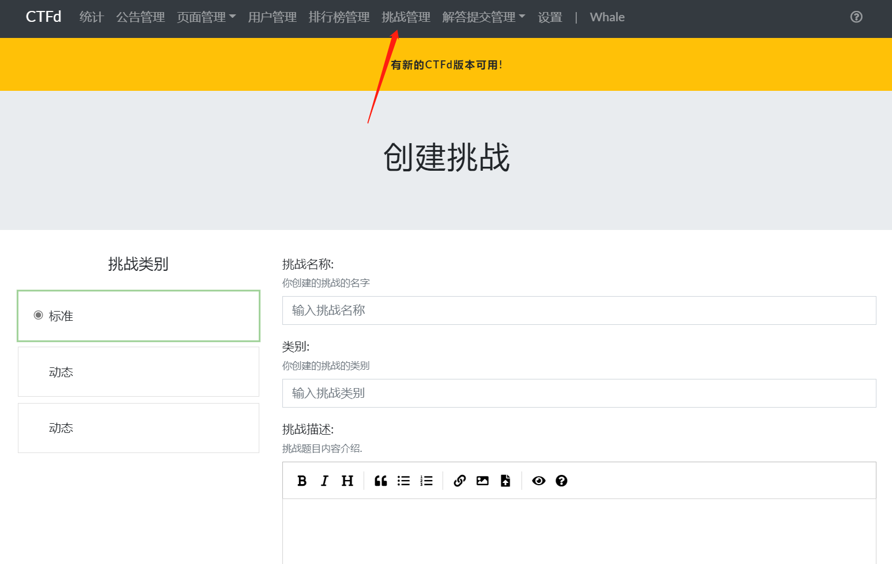

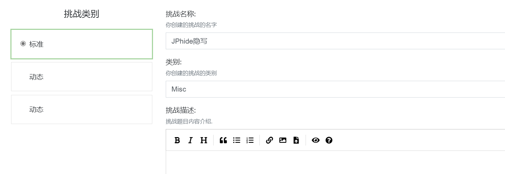

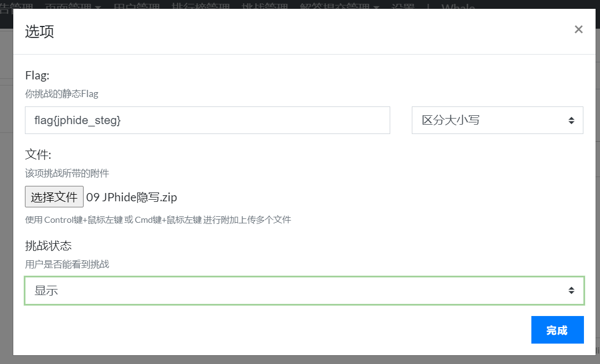

# Web动态flag

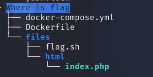

### 配置docker-compose.yml

```sh
version: "2"
services:

  web:
    build: .
    restart: always
    environment:
      - FLAG=flag{This_is_s0_simpl3}
```

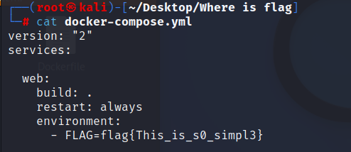

### 配置Dockerfile

```sh
FROM ctftraining/base_image_nginx_mysql_php_73

LABEL Author="jchan <jchan-l@qq.com>"

COPY ./files /tmp/
RUN cp -rf /tmp/html /var/www/ \
    && cp -f /tmp/flag.sh /flag.sh \
    && chown -R www-data:www-data /var/www/html \
```

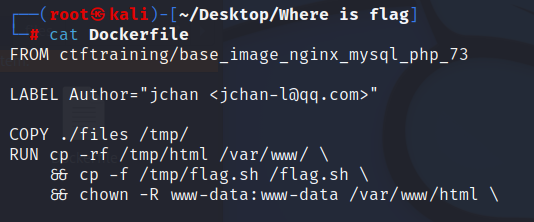

### flag.sh、docker-compose.yml和index.php里面的flag要一样才能实现动态flag

```sh
sed -i "s/flag{This_is_s0_simpl3}/$FLAG/" /var/www/html/index.php
export FLAG=not_flag
FLAG=not_flag

rm -f /flag.sh
```

**注意：flag在哪个文件，flag.sh第一行的路径就要写flag这个文件的路径**

## 构建容器

```sh
docker build -t whereisflag .
# -t 镜像名字 
```

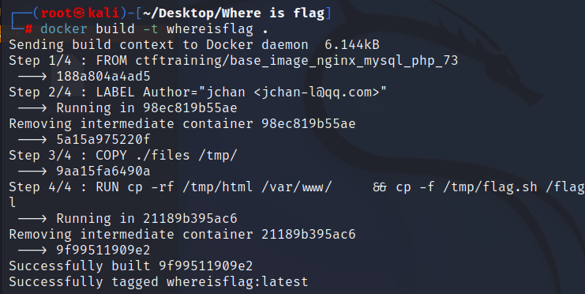

## 登录Dockerhub

```sh
docker login
```

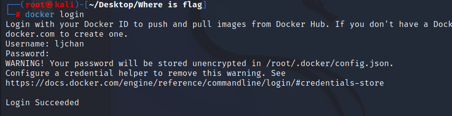

## 推送镜像到Dockerhub

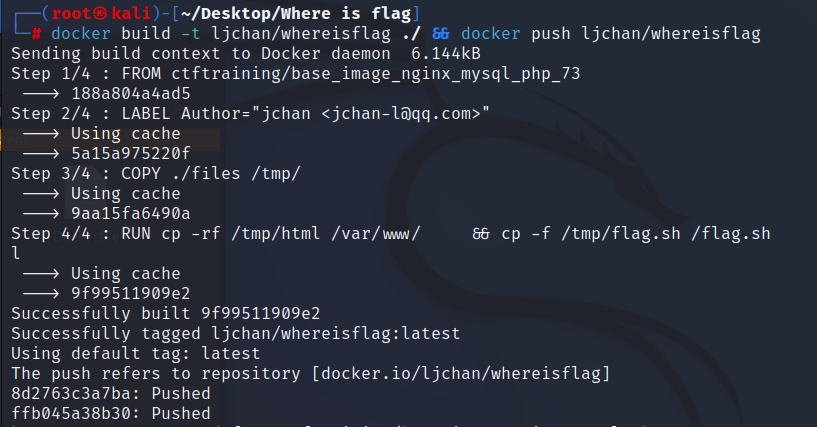

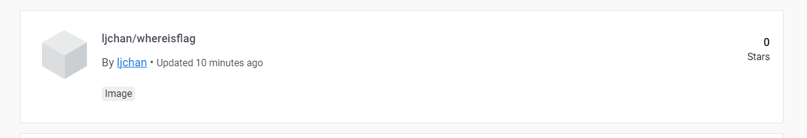

## 配置CTFd

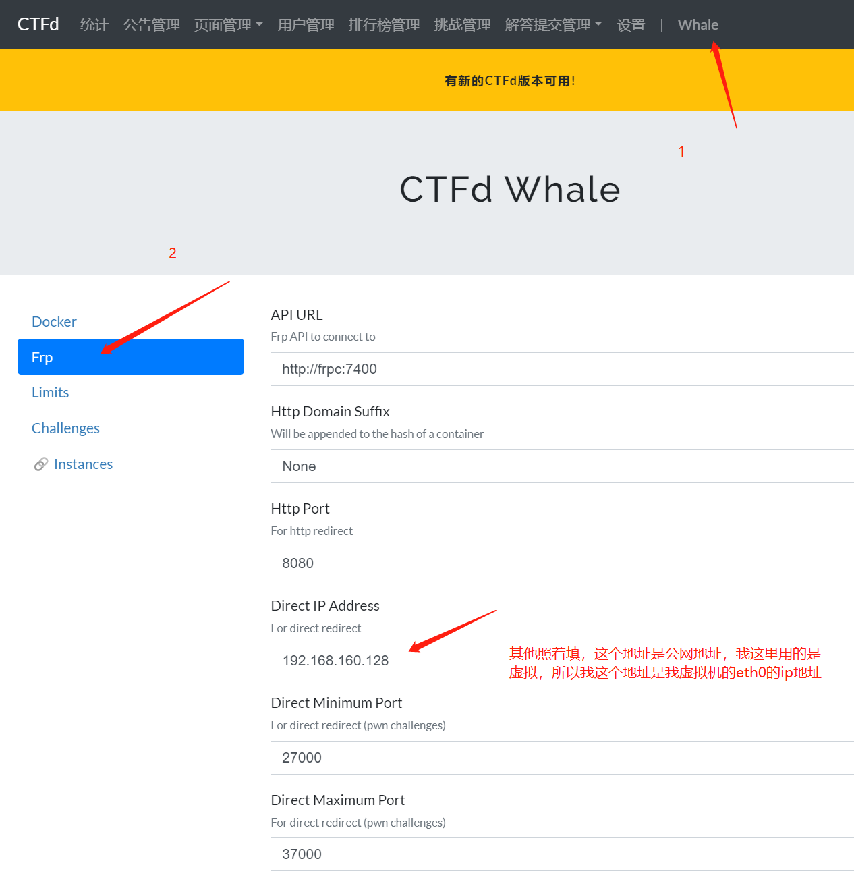

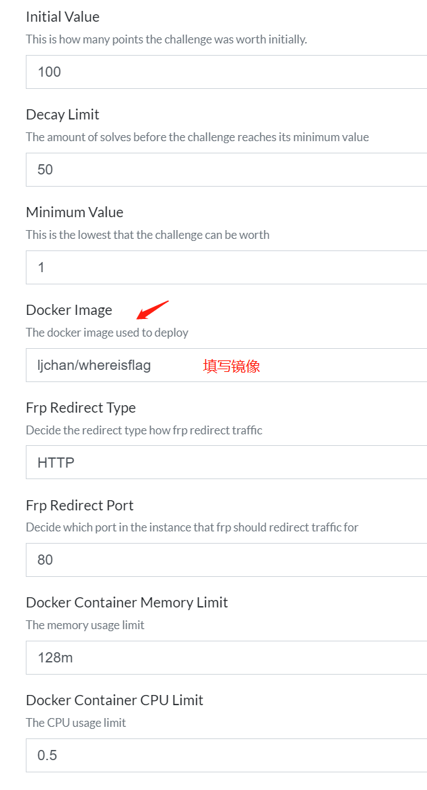

#### 不需要填写flag

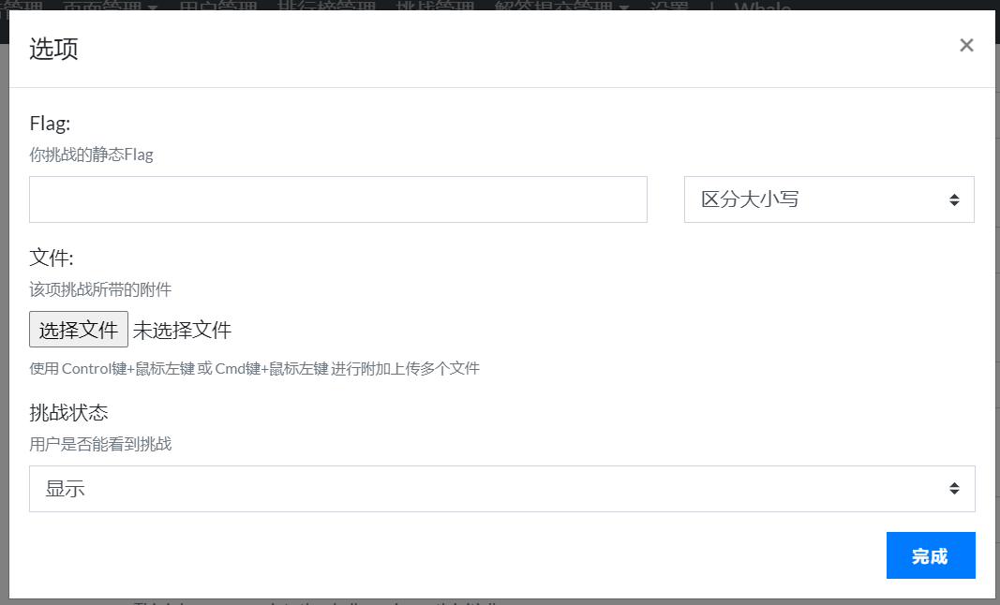
