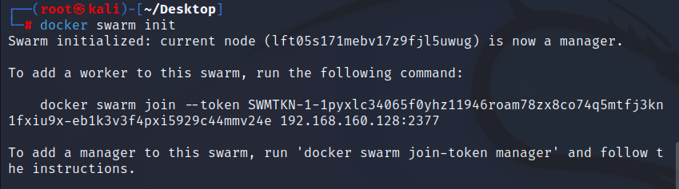
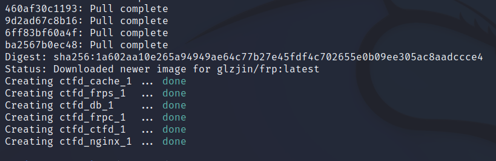
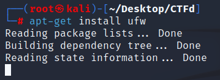

# 系统换源

#### /etc/apt/sources.list

```sh
#清华大学

deb http://mirrors.tuna.tsinghua.edu.cn/kali kali-rolling main contrib non-free

deb-src https://mirrors.tuna.tsinghua.edu.cn/kali kali-rolling main contrib non-free

#阿里云

deb http://mirrors.aliyun.com/kali kali-rolling main non-free contrib

deb-src http://mirrors.aliyun.com/kali kali-rolling main non-free contrib

#中科大

deb http://mirrors.ustc.edu.cn/kali kali-rolling main non-free contrib

deb-src http://mirrors.ustc.edu.cn/kali kali-rolling main non-free contrib

#浙大

deb http://mirrors.zju.edu.cn/kali kali-rolling main contrib non-free

deb-src http://mirrors.zju.edu.cn/kali kali-rolling main contrib non-free

#东软大学

deb http://mirrors.neusoft.edu.cn/kali kali-rolling/main non-free contrib

deb-src http://mirrors.neusoft.edu.cn/kali kali-rolling/main non-free contrib
```

#### chmod 666 /etc/apt/sources.list

#### 运行 apt-get update && apt-get upgrade更新索引以生效

# Docker环境安装

#### apt install docker.io


如果启动时发现如下错误请重新跟新源，重新下载


## Docker-compose安装

```sh
curl -L https://get.daocloud.io/docker/compose/releases/download/1.29.2/docker-compose-`uname -s`-`uname -m` > /usr/local/bin/docker-compose
chmod +x /usr/local/bin/docker-compose
```


## Docker开机启动

```sh
systemctl start docker
systemctl enable docker
```

## Docker加速

```sh
sudo mkdir -p /etc/docker
sudo tee /etc/docker/daemon.json <<-'EOF'
{
  "registry-mirrors": ["https://si9m86nl.mirror.aliyuncs.com"]
}
EOF
sudo systemctl daemon-reload
sudo systemctl restart docker
```

# Docker集群设置

```sh
docker swarm init		# 初始化
docker node ls			# 查看节点ID
docker node update --label-add='name=linux-1' $(docker node ls -q) # 添加别名
```




# 下载CTFd修改版

**博主 @Vicosna 已经对CTFd v3.3.1官方源码进行了更换国内镜像源、添加CTFd-Whale子模块、配置frp网络、设置静态文件CDN加速等工作。**

```sh
git clone -b frp https://github.com/vicosna/CTFd.git		# 修改版（根目录不建议修改名字）
cd CTFd														# 进入CTFd目录
git submodule update --init 								# 更新CTFd-Whale子模块

# ——————————————————————————————————————————————————————
# 如果你访问Github的速度不佳，也可以使用博主提供的CSDN和Gitee版（可选）
git clone -b https://codechina.csdn.net/vicosna/CTFd.git	# CSDN
cd CTFd														# 进入CTFd目录
sed -i 's/github.com/codechina.csdn.net/g' .gitmodules		# 修改子模块Url
git submodule update --init 								# 更新CTFd-Whale子模块
# ——————————————————————————————————————————————————————
git clone -b frp https://gitee.com/vicosna/CTFd.git			# Gitee
cd CTFd														# 进入CTFd目录
sed -i 's/github.com/gitee.com/g' .gitmodules				# 修改子模块Url
git submodule update --init 								# 更新CTFd-Whale子模块

```


# 构建镜像

```sh
docker-compose build
```


# 部署容器

```sh
docker-compose up -d
```



```sh
开docker ps -a
```


# 访问CTFd


# 汉化

**汉化包：https://github.com/Gu-f/CTFd_chinese_CN/tree/master/V3.4.1/CTFd-3.4.1/CTFd**

**将/root/Desktop/CTFd/CTFd/themes/下的admin，core 替换成汉化包里的 admin，core**


# 防火墙开放端口

## 安装ufw

```sh
apt-get install ufw
```



## 开启27000到37000个端口


