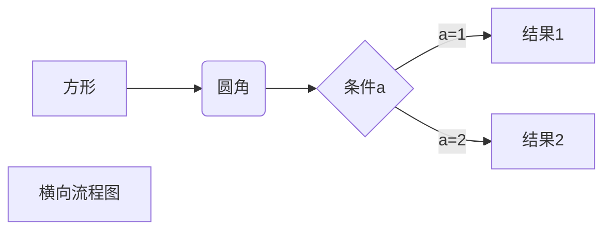
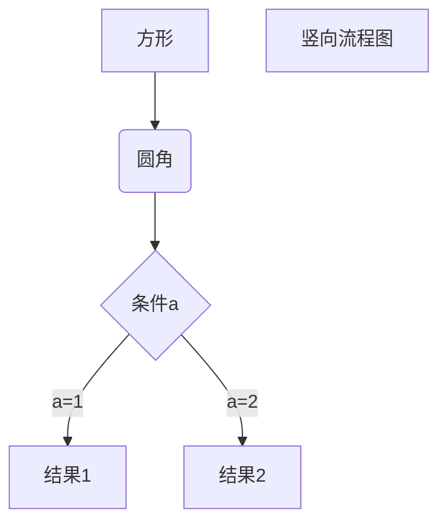

# Markdown教程
## 标题
1. 使用 = 和 - 标记一级和二级标题
   ```markdown
   这是一级标题
   ===========
   这是二级标题
   -----------
   ```
2. 使用 # 号标记
   ```markdown
   # 一级标题
   ## 二级标题
   ### 三级标题
   #### 四级标题
   ##### 五级标题
   ###### 六级标题
   ```

## 段落
两个以上空格加上回车即可换行

## 字体
```markdown
*斜体文本*
_斜体文本_
**粗体文本**
__粗体文本__
***粗体斜文本***
___粗体斜文本___
```

## 分隔线
使用3个以上（星号）*,（减号）-,（底线）_,

注：行内不能有任何东西
```markdown
***
* * *
*******
---
___
```

## 删除线
在文字两端加上两个波浪线~~，如下：
```
~~你真是个小傻瓜~~
```
> ~~你真是个小傻瓜~~

## 下划线
通过HTML```<u>```标签来实现
```
<u>带下划线文本</u>
```

> <u>带下划线文本</u>

## 脚注
脚注是对文本的补充说明。
创建脚注格式类似这样[^RUNOOB]
[^RUNOOB]:菜鸟教程 -- 学的不仅是技术，更是梦想！！！
```
代码如下：
创建脚注格式类似这样 [^RUNOOB]
[^RUNOOB]: 菜鸟教程 -- 学的不仅是技术，更是梦想！！！
```

## 列表
**这些标记后面必须要有一个空格**
1. 无序列表：
	星号（*）；
	加号（+）；
	减号（-）；
	```
	* 第一项
	+ 第二项
	- 第三项
	```
	> * 第一项
	> + 第二项
	> - 第三项

2. 有序列表，数字后面加上```.```，如：
	```
	1. 第一项
	2. 第二项
	```
3. 列表嵌套
   ```
	1. 第一项：
       - 第一项嵌套的第一个元素
           1. 第一项嵌套的第一个元素的第一个元素  
       - 第一项嵌套的第二个元素
   2. 第二项：
       - 第二项嵌套的第一个元素
       - 第二项嵌套的第二个元素
   ```

   1. 第一项：
       - 第一项嵌套的第一个元素
          1. 第一项嵌套的第一个元素的第一个元素  
       - 第一项嵌套的第二个元素
   2. 第二项：
       - 第二项嵌套的第一个元素
       - 第二项嵌套的第二个元素

## 区块
段落开头使用```>```符号 ，然后后面紧跟一个空格符号：
```
> 区块引用
```
> 区块引用

另外区块是可以嵌套的，一个```>```符号是最外层，两个```>```符号是第一层嵌套，以此类推：
```
> 最外层
> > 第一层嵌套
> > > 第二层嵌套
```
> 最外层
> > 第一层嵌套
> > > 第二层嵌套

**区块中使用列表**

```
> 区块中使用列表
> 1. 第一项
> 2. 第二项
> + 第一项
> + 第二项
> + 第三项
```
> 区块中使用列表
> 1. 第一项
> 2. 第二项
> + 第一项
> + 第二项
> + 第三项

**列表中使用区块**

如果要在列表项目内放进区块，那么就需要在 > 前添加四个空格的缩进。


列表中使用区块实例如下：
```
* 第一项
    > 菜鸟教程
    > 学的不仅是技术更是梦想
* 第二项
```

* 第一项
    > 菜鸟教程
    > 学的不仅是技术更是梦想
* 第二项

## 代码
如果是段落上的一个函数或片段的代码可以用反引号把它包起来（`），例如：  
```
`printf()` 函数
```
`printf()` 函数

## 链接
```
[链接名称](链接地址)

或者

<链接地址>

这是一个链接 [菜鸟教程](https://www.runoob.com)
```

这是一个链接[菜鸟教程](https://www.runoob.com)

<https://www.runoob.com>

**高级链接**
```
这是个链接[百度][baidu]

[baidu]: http://www.baidu.com
```
这是个链接[百度][baidu]

[baidu]: http://www.baidu.com

## 图片
**图片语法格式如下**：

```


```


## 表格
**使用 `|` 来分隔不同的单元格，使用 `-` 来分隔表头和其他行。**

```
|  表头   | 表头  |
|  ----  | ----  |
| 单元格  | 单元格 |
| 单元格  | 单元格 |
```
|  表头   | 表头  |
|  ----  | ----  |
| 单元格  | 单元格 |
| 单元格  | 单元格 |

**对齐方式**
- `-:`设置内容和标题栏居右对齐
- `:-`设置内容和标题栏居左对齐
- `:-:`设置内容和标题栏居中对齐

```
| 左对齐 | 右对齐 | 居中对齐 |
| :-----| ----: | :----: |
| 单元格 | 单元格 | 单元格 |
| 单元格 | 单元格 | 单元格 |
```

| 左对齐(单元格) | 右对齐(单元格) | 居中对齐(单元格) |
| :- | -: | :-: |
| 单元格 | 单元格 | 单元格 |
| 单元格 | 单元格 | 单元格 |

## 高级用法
不在 Markdown 涵盖范围之内的标签，都可以直接在文档里面用 HTML 撰写。
目前支持的 HTML 元素有：`<kbd> <b> <i> <em> <sup> <sub> <br>`等 ，如：
```
使用 <kbd>Ctrl</kbd>+<kbd>Alt</kbd>+<kbd>Del</kbd> 重启电脑
```
使用 <kbd>Ctrl</kbd>+<kbd>Alt</kbd>+<kbd>Del</kbd> 重启电脑

**转义**
Markdown 使用反斜杠转义特殊字符：
> **文本加粗** 
> \*\* 正常显示星号 \*\*

**公式**
插入数学公式时，使用两个美元符 `$$` 包裹 TeX 或 LaTeX 格式的数学公式来实现。提交后，问答和文章页会根据需要加载 Mathjax 对数学公式进行渲染。如：
```
$$
\mathbf{V}_1 \times \mathbf{V}_2 
$$
```

$$
\mathbf{V}_1 \times \mathbf{V}_2 
$$

### 流程图



> \`\`\`mermaid
> graph LR
> A[方形] -->B(圆角)
>     B --> C{条件a}
>     C -->|a=1| D[结果1]
>     C -->|a=2| E[结果2]
>     F[横向流程图]
> \`\`\`




> \`\`\`mermaid
> graph TD
A[方形] --> B(圆角)
    B --> C{条件a}
    C --> |a=1| D[结果1]
    C --> |a=2| E[结果2]
    F[竖向流程图]
> \`\`\`


```flow
st=>start: 开始框
op=>operation: 处理框
cond=>condition: 判断框(是或否?)
sub1=>subroutine: 子流程
io=>inputoutput: 输入输出框
e=>end: 结束框
st->op->cond
cond(yes)->io->e
cond(no)->sub1(right)->op
```

> \`\`\`flow
st=>start: 开始框
op=>operation: 处理框
cond=>condition: 判断框(是或否?)
sub1=>subroutine: 子流程
io=>inputoutput: 输入输出框
e=>end: 结束框
st->op->cond
cond(yes)->io->e
cond(no)->sub1(right)->op
> \`\`\`
